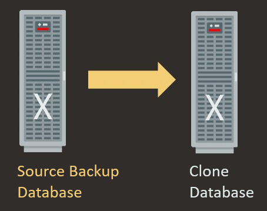
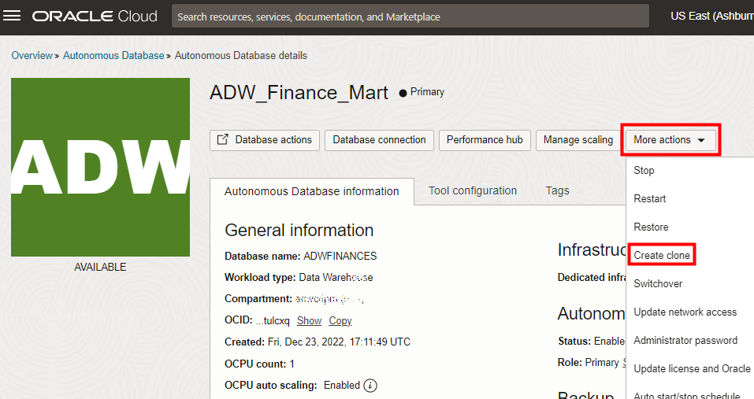
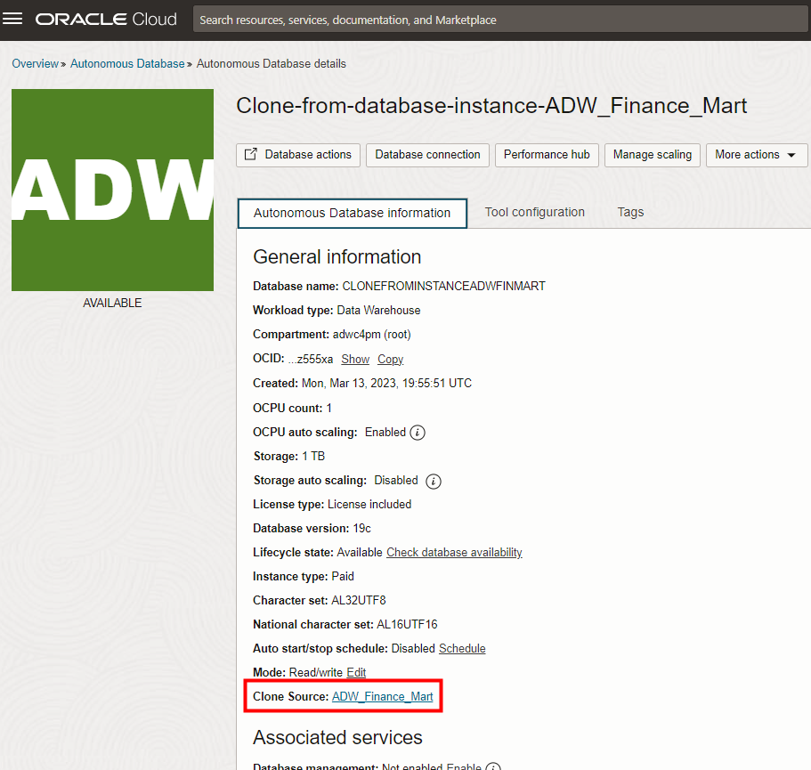
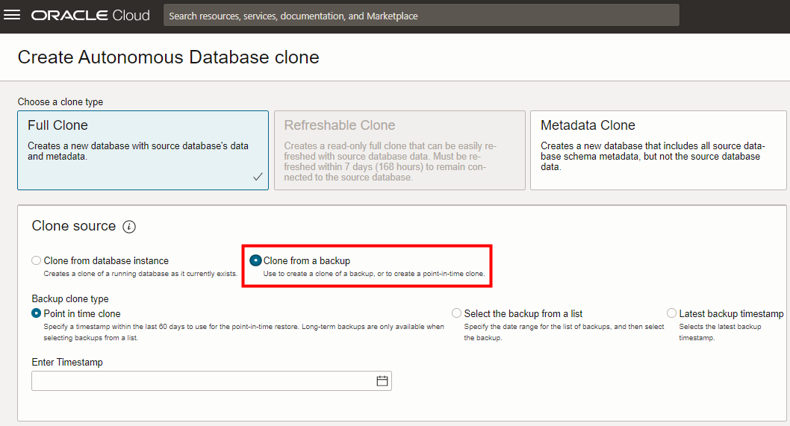
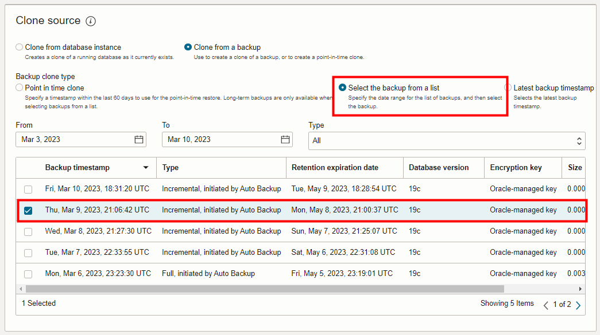
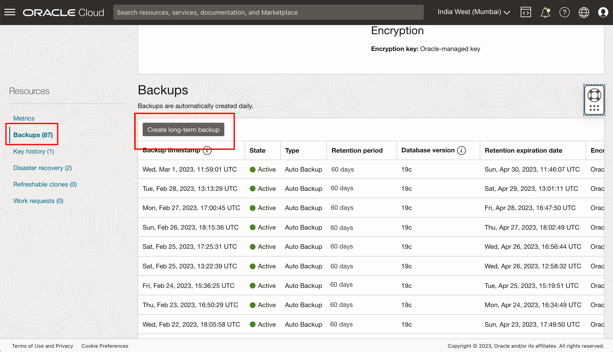
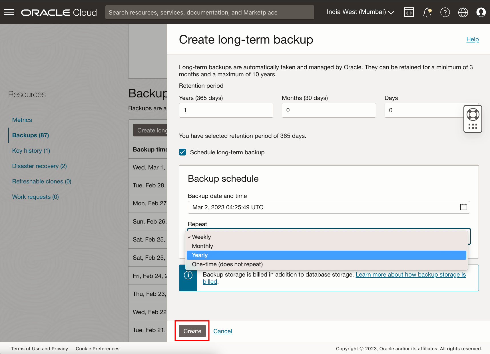
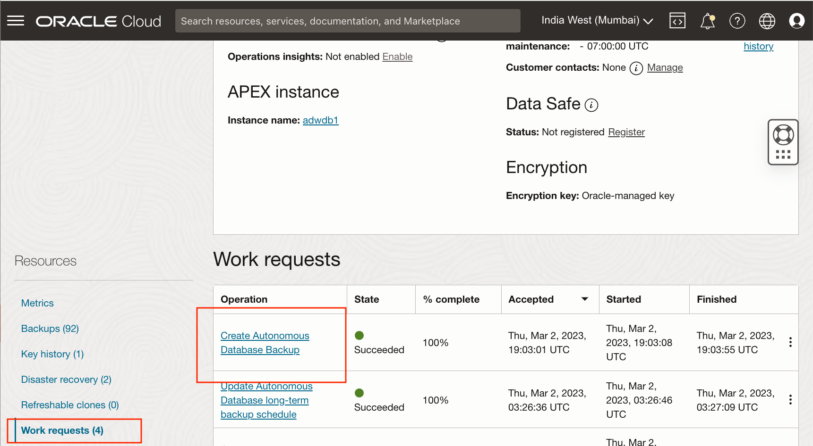
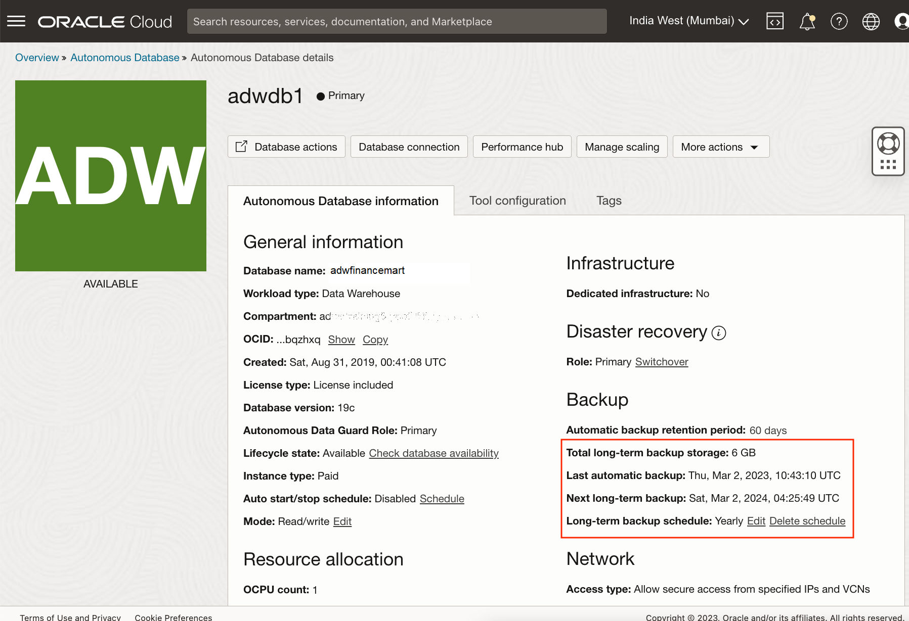


# Create a Clone Database

## Introduction

One of the most widely used features in Autonomous Database on Shared Infrastructure (ADB-S) is the ability to clone your database, no matter how big or small, with little to no effort.

This lab shows how to create a **full** clone from the **currently running** database or from a **backup** timestamp of that database.

In addition, you will see how to create that clone from backup as a **cross-region** clone, if your tenancy is subscribed to multiple regions.

  

(The next lab will show you how to create a **refreshable** read-only clone that automatically refreshes when the data in its source database changes.)

Estimated Lab Time: 10 minutes

### Objectives

In this lab, you'll:

- Create a clone from the currently running primary database.
- Create a clone from a backup database.
- Examine how to create a clone from backup as a cross-region clone.
- Create a long-term backup.

## Task 1: Navigate to Clone Creation

1. Return to the Autonomous Database details page of your source database. From the **More actions** drop-down menu, select **Create clone**.

    

## Task 2: Create a Clone Database from the Currently Running Primary database

Create a full clone database from your currently running primary database.

1. The Create Autonomous Database clone dialog appears. For **Choose a clone type**, accept the default **Full Clone**. Note the text describing it; you are creating a new database with the source database's data and metadata.

    

2. For **Clone source**, note that the default selection is **Clone from database instance**.

    

3. Provide the required information to create the clone database. The preferred region by default is your current region. Provide a display name and database name. Fill the other sections of this screen as you did in the earlier lab on provisioning an autonomous database:
    - Configure the Database
    - Create administrator credentials
    - Choose network access
    - Choose license and Oracle Database edition
    - Provide contacts for operational notifications and announcements

    Click **Create Autonomous Database clone**.

    

4. When the clone finishes provisioning, check the clone information in the Autonomous Database details page.

    

## Task 3: Create a Clone Database from a Backup Timestamp of your Database

Create a full clone database from a **backup timestamp** of your currently running primary database.

1. Return to the Autonomous Database details page of your source database. From the **More actions** drop-down menu, select **Create clone**. The Create Autonomous Database clone dialog appears. For **Choose a clone type**, accept the default **Full Clone**. Note the text describing it; you are creating a new database with the source database's data and metadata.

    

2. For **Clone source**, note that the default selection is **Clone from database instance**. Instead, select **Clone from a backup**. More selection fields appear in the **Clone source** area.

    In the **Backup clone type** area, you can choose a **Point in time clone**, **Select the backup from a list**, or simply choose the **Latest backup timestamp.**

   

3. In the **Backup clone type** area, click **Select the backup from a list**. A list of backups appear. Choose one of the backups to create the clone.

    **Note:** Backups are created daily. In this lab environment, you may not yet have any backups listed if you recently created your autonomous database.

    

4. Provide the required information to create the clone database. The preferred region by default is your current region. Provide a display name and database name. Fill the other sections of this screen as you did in the earlier lab on provisioning an autonomous database:
    - Configure the Database
    - Create administrator credentials
    - Choose network access
    - Choose license and Oracle Database edition
    - Provide contacts for operational notifications and announcements

    Click **Create Autonomous Database clone**.

    

5. When the clone finishes provisioning, check the clone information in the Autonomous Database details page.

    

## Task 4: Examine How to Create a Clone from Backup in a Remote Region

If your tenancy subscribes to multiple regions, you can clone across regions from any of your selected database backups. When creating your cross-region clone, you can easily select the remote region to which you wish to clone from backup. You may clone a database from any available backup timestamp within the last 60 days to any region to which your tenancy is subscribed.

1. Let's take a look back at the **Create Autonomous Database clone** dialog. In the **Provide basic information for the Autonomous Database clone** section, the **Choose your preferred region** field defaults to your current region. To create a cross-region clone, simply open this field and choose among the regions to which your tenancy subscribes.

    

## Task 5: Create Long-term Backups

In today's world, regulations, audits, and compliance requirements often demand long-term retention of data. For instance, in the financial or healthcare sector, you may have to keep transactional and patient data for several years, if not decades. You may need long-term backups for compliance and regulatory requirements, legal and contractual obligations, historical analysis, or for business continuity in response to data loss.

It is essential to have a database backup plan that covers both short-term and long-term retention. As with other aspects of Oracle Autonomous Database, the process of long-term backups is completely automated and managed by Oracle.

1. Scroll down the Autonomous Database details page for your database and select **Backups** under your database's **Resources** section. You will see the **Create long-term backup** button.

    

2. The **Create long-term backup** dialog appears. Backups on Autonomous Database are completely automated. Provide the following information:
    - When you would like a long-term backup to be taken (Immediately, at a scheduled time in the future, or repeatedly at your preferred cadence)
    - How long you would like us to keep a long-term backup for you (that is, the backup retention period). While your existing automatic backups have a backup retention period of 60 days, long-term backups can be retained starting from 90 days all the way up to 10 years.

    You may also automate long-term backups at your own, personalized cadence by calling long-term backup CLI APIs in your scripts or via Terraform.

    

    Click **Create**.

3. When you click Create, Oracle starts an asynchronous job to create a long-term backup for you in the background, so your database is not held up waiting for the backup to complete. You can track this long-term backup and other lifecycle management (LCM) operations triggered on your database by clicking the **Work Requests** tab.

    

4. When your long-term backup is available, you will see it in your list of backups. Each long-term backup is a standalone backup that can be managed individually. You may edit the retention period of a long-term backup, delete it if you no longer need it, or clone from the backup when you need an instantiated database copy from that long-term backup.

    It is good practice to test your long-term backup after creating it by cloning from it, to ensure your backed up data is as required.

    

5. From the Autonomous Database details page, you can view the details of any scheduled long-term backups and you can edit a long-term backup schedule. Note that the  console also presents the size of backups you are paying for - While 60 day automatic backups are included with OCPU-based databases, long-term backups will be billed additionally at your database storage rate.

    

## Learn More

- ADW Documentation: [Clone an Autonomous Database from a Backup](https://docs.oracle.com/en/cloud/paas/autonomous-database/adbsa/autonomous-clone-backup.html#GUID-20D2D970-0CB4-472F-BF89-1EE769BFB5E8)
- ADW Documentation: [Create a Long-Term Backup](https://docs.oracle.com/en/cloud/paas/autonomous-database/adbsa/backup-long-term.html)

## Acknowledgements

- **Author** - Rick Green, Principal Developer, Database User Assistance
- **Last Updated By/Date**  - Rick Green, March 2023
